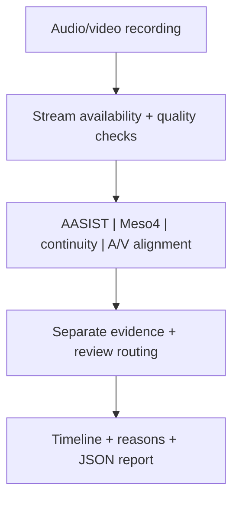

# DeepShield ApprovalGuard

Project report | Harsh Saand | 22 September 2026

## The problem

When a sensitive instruction arrives by voice or video, one combined score can conceal missing or conflicting evidence. DeepShield exposes separate media-integrity signals so a reviewer can examine the recording and decide what needs checking.

## What a user gets

The workbench returns timestamped voice, face, continuity and audio/video alignment evidence, quality checks, review routing and a downloadable JSON record.

## Practical value

The demonstrated workflow supports inspection of media signals. The measured benchmark covers the audio branch only, with threshold selection on the same subset. The combined workflow has not been independently validated as a real-world deepfake detector.

## Logic and flow

<strong>Data included with the project</strong>

The repository is immediately testable with 48 labelled files:

- **24 five-second MP4 workflow fixtures:** six controls, six audio replacements, six visible identity-region edits, and six audio-video desynchronisation cases;
- **24 ASVspoof 2021 DF audio examples:** 12 bona-fide and 12 spoof clips for direct voice-model testing.

Labels, transformations, affected intervals, and provenance are documented in `dataset/manifest.csv` and `dataset/asvspoof_examples/manifest.csv`. The MP4 files are functional fixtures, not a scientific accuracy benchmark. `DATASET_CARD.md` explains the evaluation boundaries, while `DATASET_OPTIONS.md` identifies larger datasets for broader testing.

<strong>Technical snapshot</strong>

| Question | Implementation |
|---|---|
| What enters the system? | Audio-only or audio-video financial instruction recordings |
| What is analysed? | Synthetic voice, face manipulation, visual continuity, media quality, and audio-video timing |
| How is evidence presented? | Separate branch scores, timestamped segments, reasons, quality fields, and a downloadable JSON record |
| When does it abstain? | When required streams are absent, unusable, or provide insufficient evidence |
| What does the routing layer produce? | `STANDARD`, `REVIEW`, `ESCALATE`, or `INSUFFICIENT EVIDENCE` |
| What does it not claim? | Identity verification, intent inference, a calibrated fraud probability, or production readiness |

<strong>How it works</strong>

### AI components

| Evidence branch | Implementation | What it contributes |
|---|---|---|
| Synthetic voice | AASIST spectro-temporal graph-attention network | Spoof evidence for the complete clip and temporal windows |
| Face manipulation | DeepfakeBench Meso4 compact CNN | Frame-level face-region manipulation evidence |
| Recording continuity | ImageNet-pretrained ResNet-18 embeddings | Learned visual discontinuity between neighbouring segments |
| Audio-video timing | Mouth-motion and audio-activity correlation | Interpretable synchronisation evidence; this branch is signal processing rather than a trained lip-reading model |

The decision layer deliberately keeps these signals separate. Its priority index is a routing aid, not a fraud probability. Two high signals suggest escalation; one high signal or two elevated signals suggest independent review. Poor-quality or missing inputs can produce an insufficient-evidence result.

<strong>Locally measured voice-model result</strong>

AASIST was evaluated locally on a balanced 570-file subset of ASVspoof 2021 DF:

| Metric | Result |
|---|---:|
| ROC-AUC | 0.9078 |
| Equal error rate | 18.60% |
| Accuracy at the subset-selected EER threshold | 81.40% |
| Spoof precision | 81.40% |
| Spoof recall | 81.40% |
| Mean model inference time on Apple MPS | 17.44 ms/file |

The threshold was selected and measured on the same showcase subset, so these numbers describe the implementation experiment rather than an independent production estimate. The exact summary and all 570 per-file scores are available in `evaluation/`.

<strong>Evaluation status</strong>

The saved quantitative experiment evaluates the **AASIST audio branch only**. The visual, continuity, synchronisation, and combined routing branches are demonstrated with functional fixtures, not validated as a complete multimodal detector on an independent held-out dataset. The 24 MP4 cases verify workflow behaviour under known transformations; they do not establish generalisation to real attacks.

<strong>Technical boundaries</strong>

- The implementation detects media-integrity evidence; it does not establish identity or intent.
- AASIST was trained in an audio anti-spoofing domain and can shift under unseen speakers, codecs, noise, and generators.
- Meso4 uses a portable centre-region crop here; a production pipeline would require robust face detection and alignment.
- The demonstration videos are workflow fixtures outside the training domains of AASIST and Meso4.
- Scores are evidence scales, not calibrated probabilities.
- Deployment would require representative institutional data, independent validation, threshold calibration, monitoring, access controls, and human review.

See `THIRD_PARTY_MODELS.md` for model provenance and checkpoint hashes, and `API.md` for programmatic use.

## Evidence and reproduction references

Source revision: de51602f65cb9a7e669845da193a3d46240b53ef

- [README.md](https://github.com/HarshSaand/deepshield-approvalguard/blob/de51602f65cb9a7e669845da193a3d46240b53ef/README.md)
- [docs/output-example.json](https://github.com/HarshSaand/deepshield-approvalguard/blob/de51602f65cb9a7e669845da193a3d46240b53ef/docs/output-example.json)

This report describes the source and saved evidence at the revision above. Training and full benchmark runs were not repeated for this documentation release. Dataset, model and dependency licences remain separate from the project documentation.
